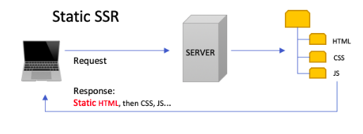
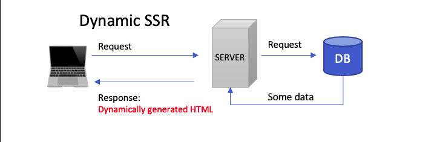

# Web Development Workshop
This workshop will be centered around **Server Side Rendering** with Python and Django.
### What is Server Side Rendering (SSR)?
To understand this let's take a look at how a normal plain static website's architecture would look.

With this approach, there is no way to add any dynamic data unless you use a JavaScript request, which may not always be ideal, because you may want the data to be displayed right on the page load to the user, instead of waiting for a separate request to finish.

Using the approach above the HTML is filled with data from the server, usually from a database.
### Why use SSR (Pros)?
- You want data on your page to be seen as soon as the page gets send to the user
- You want your website to be easily indexed by search engines.
- Has a quick First Content Paint, which is just how fast the page is actually visible
- Routes are whole separate requests instead of baked into one JavaScript bundle
### Why wouldn't you use SSR (Cons)?
- You want fast navigation between several pages.
- Overall the server will be busier.
- You would be creating a whole web application similar to a desktop one.
## Installing Python and Django
In this we will be using Python and a web framework Django. Make sure you have at least python 3, you can check by running `python --version` or on Linux `python3`. 

**NOTE**: On linux you may or may not have to do many steps to get python 3 and pip 3 symbolically linked in order to work. If you encounter this go [HERE](https://www.howtoforge.com/tutorial/how-to-install-django-on-ubuntu/)

After python 3 is setup run `pip install django`. Restart your terminal and make sure `django-admin` is recognized as a command. That means everything is installed. 
## Useful Commands
- Running the server: `python manage.py runserver <PORT>`
- Making a new App: `python manage.py startapp <APP_NAME>`
- Migrate: `python manage.py migrate` This will setup the database with django's custom models
- Migrate app: `python manage.py makemigrations <APP_NAME>` This will update the database models you created in an app
- For more information about django go [HERE](https://www.djangoproject.com/start/)

